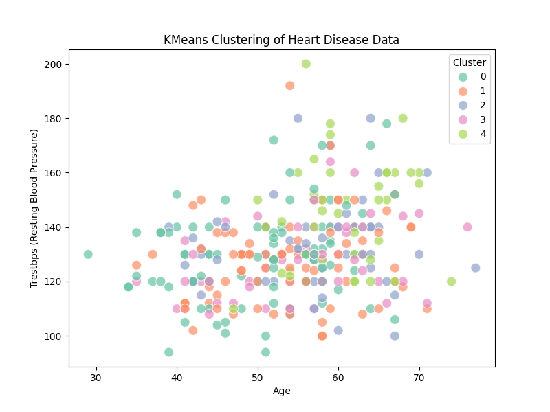

# گزارش پروژه خوشه‌بندی داده‌های قلب

## مقدمه
هدف از این پروژه، خوشه‌بندی داده‌های مربوط به بیماران قلبی با استفاده از الگوریتم KMeans و بررسی ویژگی‌های مهم مانند فشار خون و سن است. داده‌های مورد استفاده از فایل `heart-c.arff` بارگذاری شده و شامل اطلاعاتی در مورد بیماران و وضعیت قلبی آن‌هاست.

---

## مراحل پیاده‌سازی

### 1. بارگیری و آماده‌سازی داده‌ها
داده‌ها از فایل `heart-c.arff` بارگذاری شده و به DataFrame تبدیل شدند. برخی از ستون‌ها به دلیل نوع داده (byte) به رشته تبدیل شدند. سپس ستون‌های دسته‌ای (Categorical) با استفاده از `LabelEncoder` کدگذاری شدند.

### 2. جایگزینی مقادیر گمشده
با استفاده از `SimpleImputer`، مقادیر گمشده (NaN) در ستون‌ها با میانگین مقادیر همان ستون جایگزین شدند.

### 3. اجرای الگوریتم KMeans
- تعداد خوشه‌ها (`k`) برابر با 5 انتخاب شد.
- الگوریتم KMeans اجرا شده و هر داده به یکی از خوشه‌ها اختصاص یافت.
- خوشه‌ها به ستون جدیدی به نام `cluster` اضافه شدند.

---

## نتایج

### داده‌های نهایی با خوشه‌ها
جدول زیر نمونه‌ای از داده‌های نهایی با ستون خوشه را نمایش می‌دهد:

| age | sex | cp       | trestbps | chol | ... | cluster |
|-----|-----|----------|----------|------|-----|---------|
| 63  | 1   | 0        | 145      | 233  | ... | 2       |
| 67  | 1   | 3        | 160      | 286  | ... | 4       |
| 37  | 1   | 2        | 130      | 250  | ... | 1       |

### نمودار خوشه‌ها
در نمودار زیر، خوشه‌بندی داده‌ها بر اساس سن و فشار خون به تصویر کشیده شده است:

- هر رنگ نمایانگر یک خوشه است.
- خوشه‌ها نشان‌دهنده گروه‌های مشابه در بین بیماران هستند.

---

## نتیجه‌گیری
خوشه‌بندی داده‌های مربوط به بیماری قلبی توانست الگوهایی میان بیماران با ویژگی‌های مشترک مانند سن و فشار خون ایجاد کند. این روش می‌تواند برای تحلیل بهتر داده‌های پزشکی و شناسایی گروه‌های در معرض خطر مفید باشد.

---

## اطلاعات دانشجو
**نام:** فاطمه ترکمانی  
**شماره دانشجویی:** 40005043  

امیدوارم این پروژه مورد توجه شما قرار بگیرد.
با احترام.